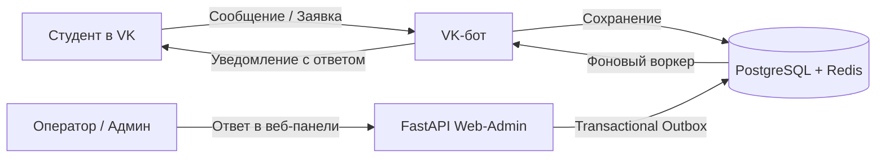

# OSS Bot

**OSS Bot** — современная омниканальная платформа для приёма, распределения и обработки студенческих обращений.  
Студенты задают вопросы и подают заявки через бота ВКонтакте, а администраторы и операторы отделов централизованно обрабатывают их через защищённую веб-панель управления.

---

## Как это устроено



1. **Приём обращения:** студент пишет в сообщения сообщества VK. Бот помогает выбрать отдел, сформулировать тему или найти ответ в базе знаний (FAQ).
2. **Маршрутизация:** заявка попадает в базу данных и закрепляется за соответствующим направлением (Жилищно-бытовой, Информационный, Корпоративный, Культурно-массовый и др.).
3. **Обработка:** операторы видят тикеты своего отдела в веб-интерфейсе, берут их в работу и пишут ответ.
4. **Гарантированная доставка:** через механизм **Transactional Outbox** ответ надёжно отправляется студенту обратно в личные сообщения VK даже при временных сбоях сети или перезагрузках сервиса.

---

## Ключевые возможности

### Для студентов
- **Подача обращений:** удобное пошаговое оформление с возможностью отправки анонимно.
- **Статус заявки:** просмотр открытых и архивных тикетов, получение уведомлений об ответах.
- **Интерактивный FAQ:** дерево частых вопросов и мгновенные ответы без участия оператора.
- **Афиша мероприятий:** просмотр анонсов студенческих событий и запись на них в один клик.

### Для операторов отделов
- **Изолированная очередь:** оператор видит только обращения своего отдела, не отвлекаясь на чужие.
- **Быстрые ответы:** отправка сообщений студенту прямо из карточки тикета.
- **Управление статусами:** смена состояний («В работе», «Решено», «Отклонено»), передача коллегам.

### Для суперадминистраторов
- **Полный контроль:** сквозной просмотр всех тикетов по всем направлениям.
- **Управление доступом:** создание учётных записей с ролевой моделью (`DEPARTMENT_ADMIN`, `SUPERADMIN`) и привязкой к VK ID для 2FA.
- **Аналитика и отчётность:** автоматическая генерация стандартизированных Excel-отчётов по отделам.
- **Журнал аудита:** подробная история всех действий пользователей в системе для прозрачности и контроля.
- **Безопасность:** двухфакторная аутентификация через VK, защита от перебора паролей и OTP.

---

## Технологический стек

| Компонент | Технологии | Назначение |
| :--- | :--- | :--- |
| **Backend** | Python 3.11+, FastAPI, Pydantic v2 | Веб-панель управления и REST API v1 |
| **Bot** | `vkbottle` 4.x (Long Poll / Callback API) | Приём сообщений и взаимодействие со студентами в VK |
| **База данных** | PostgreSQL 16 + Alembic | Надёжное реляционное хранилище данных и миграции |
| **Пулер соединений** | PgBouncer | Оптимизация нагрузки на СУБД в режиме транзакций |
| **Кэш и сессии** | Redis 7 | Распределённые веб-сессии, кэширование и замки воркеров |
| **Безопасность** | Argon2id, Tailscale VPN, Startup Guard | Защита сессий, 2FA и закрытый сетевой периметр |
| **Мониторинг** | Prometheus, Structured Logging | Сбор системных метрик и диагностика `/health` |

---

## Быстрый запуск (Docker)

### 1. Требования к серверу
- Linux-сервер (Ubuntu 22.04 / 24.04 или Debian) с установленными Docker Engine и Docker Compose.
- Токен сообщества ВКонтакте с включёнными сообщениями.

### 2. Клонирование и настройка окружения
```bash
git clone https://github.com/KOngfrost/Student_bot.git /opt/oss_bot
cd /opt/oss_bot

cp .env.example .env
chmod 600 .env
```

Отредактируйте `.env` и задайте основные параметры:
```env
# Режим работы
APP_ENV=production

# Секретный ключ для сессий (сгенерируйте: python3 -c "import secrets; print(secrets.token_urlsafe(64))")
SESSION_SECRET_KEY=ваш_сгенерированный_секретный_ключ

# Токен сообщества ВКонтакте и ID администраторов
VK_BOT_TOKEN=ваш_vk_токен
ADMIN_VK_IDS=123456789,987654321

# База данных PostgreSQL
POSTGRES_USER=oss_user
POSTGRES_PASSWORD=стойкий_пароль_к_бд
POSTGRES_DB=oss_bot_db
```

### 3. Запуск контейнеров
```bash
docker compose up -d
```

Проверьте статус запущенных сервисов:
```bash
docker compose ps
curl -s http://localhost:8000/health
```

### 4. Создание первого администратора
Создайте учётную запись суперадминистратора для входа в панель:
```bash
docker compose exec bot python scripts/create_web_user.py \
  --username admin \
  --role SUPERADMIN \
  --vk-id 123456789
```

Скрипт запросит пароль (или сгенерирует безопасный) и привяжет аккаунт к указанному VK ID для получения кодов двухфакторной аутентификации.

---

## Структура проекта

```
student_bot/
├── bots/                  # VK-бот (обработчики команд, меню, клавиатуры)
│   └── vk/handlers/       # Модули: тикеты, админка, FAQ, мероприятия
├── core/                  # Общее ядро: база данных, модели, Outbox, Redis, проверки безопасности
├── web/                   # FastAPI веб-панель управления
│   ├── routes/            # Маршруты админки, авторизации и REST API v1
│   ├── templates/         # HTML-шаблоны страниц
│   └── static/            # CSS стили, скрипты и ассеты интерфейса
├── alembic/               # Миграции схемы базы данных PostgreSQL
├── scripts/               # Скрипты управления (создание пользователей, бэкапы)
├── monitoring/            # Настройки Prometheus и правила алертинга
├── tests/                 # Автоматические тесты (pytest)
├── docker-compose.yml     # Описание сервисов для развёртывания
├── ROADMAP.md             # Дорожная карта и планы развития платформы
└── CHANGELOG.md           # История изменений и версий
```

---

## Разработка и тестирование

Для локальной разработки и проверки качества кода:

```bash
# Установка зависимостей
pip install -r requirements-dev.txt

# Проверка стиля и типов
ruff check .
ruff format --check .
mypy core web scripts bots

# Запуск тестов
pytest --cov=core --cov=web --cov=bots
```

---

## Документация

Подробные руководства по всем аспектам системы:

- 🗺️ **[ROADMAP.md](ROADMAP.md)** — дорожная карта проекта (Android-приложение, Telegram Mini App, Telegram-бот).
- 📋 **[CHANGELOG.md](CHANGELOG.md)** — журнал изменений по версиям.
- 🚀 **[docs/DEPLOYMENT.md](docs/DEPLOYMENT.md)** — полное пошаговое руководство по развёртыванию на сервере, настройке Tailscale и резервному копированию.
- 👥 **[docs/OPERATOR_GUIDE.md](docs/OPERATOR_GUIDE.md)** — инструкции по работе для операторов отделов, суперадминистраторов и студентов.
- 🖥️ **[docs/WEB_ADMIN_GUIDE.md](docs/WEB_ADMIN_GUIDE.md)** — руководство пользователя веб-панели управления.
- 🗄️ **[docs/ADMIN_AND_DATABASE_GUIDE.md](docs/ADMIN_AND_DATABASE_GUIDE.md)** — схема базы данных, права доступа и техническое обслуживание.