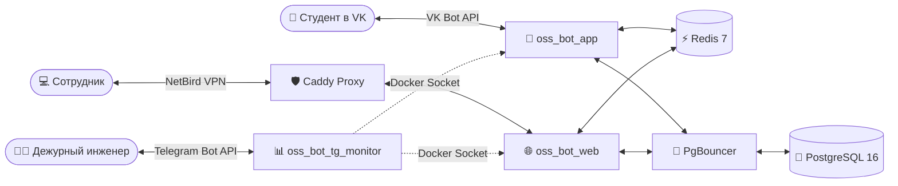

# OSS Bot — Студенческий Помощник v0.8.5

[](https://www.python.org/downloads/)
[](https://fastapi.tiangolo.com)
[](https://www.docker.com/)
[](tests/)
[](docs/SETUP_FROM_SCRATCH.md)
[](CHANGELOG.md)

**OSS Bot** — современная защищённая омниканальная платформа для приёма, автоматической маршрутизации и обработки студенческих обращений в университете.

Платформа объединяет студентов через **бота ВКонтакте**, операторов через **защищённую веб-панель управления** и дежурных инженеров через **Telegram-бота мониторинга**.

---

## 🏗️ Архитектура системы



1. **Студенческий контур (VK):** Студенты отправляют вопросы, просматривают мероприятия и читают базу знаний прямо в переписке сообщества.
2. **Операторский контур (Веб-панель):** Доступен **только** через зашифрованную оверлейную сеть **NetBird VPN** (`100.64.0.0/10`). Публичный доступ из интернета заблокирован шлюзом Caddy.
3. **Надёжная доставка (Transactional Outbox):** Любой ответ оператора гарантированно сохраняется в транзакции базы данных и доставляется студенту в VK даже при временном падении серверов соцсети.
4. **Командный пульт (Telegram):** Дежурный администратор получает моментальные алерты, следит за ресурсами сервера, управляет бэкапами и режимом техработ прямо со смартфона.

---

## 📚 Навигация по документации проекта

| Документ | Назначение и содержание |
|---|---|
| 🗺️ **[ROADMAP.md](ROADMAP.md)** | Дорожная карта развития: выполненные фазы, текущие планы, мобильное приложение и TMA. |
| 👥 **[docs/OPERATOR_MANUAL.md](docs/OPERATOR_MANUAL.md)** | **Руководство оператора:** как отвечать студентам, менять статусы, загружать FAQ из Excel. |
| 🚀 **[docs/SETUP_FROM_SCRATCH.md](docs/SETUP_FROM_SCRATCH.md)** | **Запуск с нуля:** настройка чистого Linux-сервера, Docker, NetBird VPN, Caddy, SSL и переменных. |
| 🗄️ **[docs/DATABASE_SCHEMA.md](docs/DATABASE_SCHEMA.md)** | **Схема базы данных:** полная ER-диаграмма, описание 11 таблиц, внешние ключи и GIN-индексы `pg_trgm`. |
| 📋 **[CHANGELOG.md](CHANGELOG.md)** | **Журнал версий:** история изменений от первых билдов до релиза v0.8.4.1. |

---

## ⚡ Быстрый старт (Production)

### 1. Клонирование репозитория
```bash
git clone https://github.com/KOngfrost/Student_bot.git /opt/oss_bot
cd /opt/oss_bot
```

### 2. Настройка секретов окружения
```bash
cp .env.example .env
chmod 600 .env
# Заполните обязательные токены VK, Telegram, пароли БД и NetBird ключ
nano .env
```

### 3. Сборка и запуск контейнеров
```bash
# Сборка образов
docker compose build --parallel

# Применение миграций схемы PostgreSQL
docker compose run --rm migrate

# Запуск всех сервисов в фоновом режиме
docker compose up -d --remove-orphans
```

### 4. Проверка состояния
```bash
docker compose ps
```
Все 9 контейнеров (`db`, `redis`, `pgbouncer`, `migrate`, `bot`, `web-admin`, `tg-monitor`, `caddy`, `netbird`) должны быть в состоянии `Up (healthy)`.

---

## 🧪 Тестирование и контроль качества

В системе реализовано 100% покрытие кнопочных сценариев интерфейсов:
* **21 тест Telegram-кнопок** (`tests/test_all_telegram_buttons.py`): главное меню, инлайн-кнопки статуса, перезагрузка с модальным подтверждением, просмотр логов, тумблеры техработ и 2FA, бэкапы.
* **9 тестов Web-кнопок** (`tests/test_all_web_buttons.py`): авторизация, выход, фильтрация тикетов, ответы, переводы статусов, CRUD отделов, базы знаний, мероприятий, темы и 2FA.
* **33 теста безопасности и конфигурации** (HSTS, OTP-хеши, IDOR-изоляция, лимиты, SQL-инъекции).

Запуск полного комплекта тестов:
```bash
pytest -v
# Результат: 412 passed
```

---

## 🛡️ Безопасность

* **Zero Trust & Hardened Edge:** Caddy Reverse Proxy с автоматическим HTTPS (Let's Encrypt), HSTS, защитой от DDoS и ограничением размера тела запроса (15MB).
* **HSTS & Headers:** `Strict-Transport-Security: max-age=31536000`, `X-Content-Type-Options: nosniff`, защита от clickjacking через CSP `frame-ancestors`.
* **Пароли и сессии:** Хеширование паролей Argon2id, куки с `SameSite=Lax`, двухфакторная аутентификация (2FA) с динамическим управлением, защита от брутфорса (Rate Limiting).
* **Секреты:** Файлы конфигурации `.env`, приватные ключи и дампы исключены из репозитория через `.gitignore`.

---

## 📄 Лицензия и поддержка
Проект разработан для автоматизации студенческих сервисов и поддерживается рабочей группой.
По техническим вопросам обращайтесь к дежурному инженеру платформы.