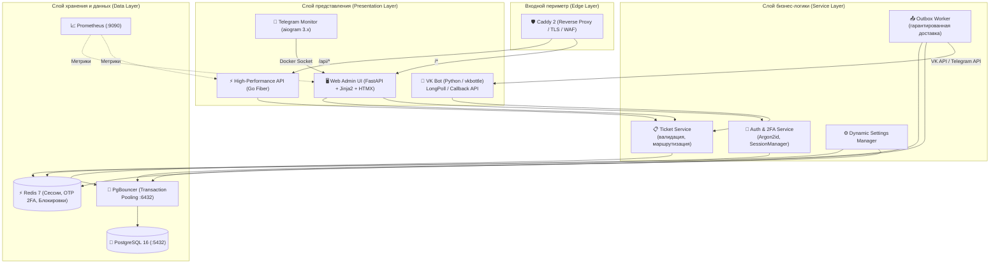
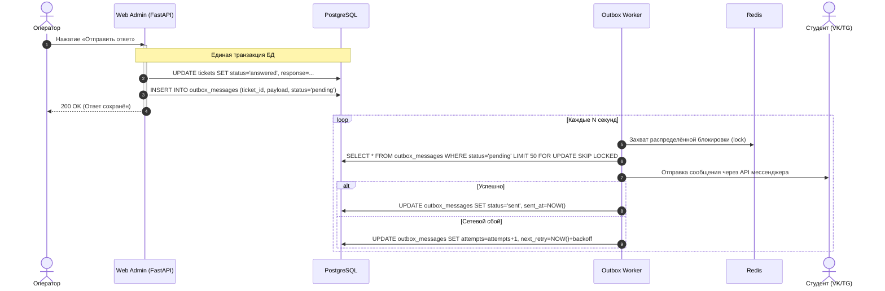

# 📐 Техническая спецификация и архитектура платформы OSS Bot (v0.8.8.3)

> **Версия системы:** 0.8.8.3  
> **Дата актуализации:** 26 сентября 2026 г.  
> **Статус:** Эксплуатация (Production)

Настоящий документ является главным техническим описанием архитектуры, компонентов, механизмов безопасности и структуры исходного кода платформы **OSS Bot**.

---

## 1. Назначение и границы системы

**OSS Bot** — омниканальная информационная система для автоматизации приёма, маршрутизации и обработки обращений студентов университета в подразделения Студенческого совета.

### 1.1. Решаемые задачи
1. Предоставление студентам удобного интерфейса для подачи обращений через популярные мессенджеры (ВКонтакте, Telegram).
2. Разделение потоков обращений по ответственным подразделениям (Жилищно-бытовой, Культурно-массовый, Информационный, Корпоративный отделы).
3. Обеспечение гарантированной доставки ответов операторов заявителям без потерь (Transactional Outbox).
4. Ведение централизованной базы знаний, часто задаваемых вопросов (FAQ) и афиши мероприятий.
5. Защита персональных данных студентов и изоляция административного контура от внешних атак.

---

## 2. Архитектура системы

Система построена по многослойной модульной архитектуре с чётким разделением ответственности:



### 2.1. Описание компонентов
- **Caddy 2**: Входная точка трафика. Автоматически выпускает и продлевает TLS-сертификаты Let's Encrypt, реализует WAF (фильтрация сканеров, SQLi, XSS), добавляет заголовки безопасности (HSTS, CSP, X-Frame-Options).
- **Web Admin (`web/`)**: Административная панель на FastAPI. Серверный рендеринг через Jinja2 + динамические вставки HTMX. Отвечает за дашборд операторов, управление контентом, динамические настройки.
- **VK Bot (`bots/vk/`)**: Клиентский модуль взаимодействия со студентами через VK API (поддерживает режимы Long Poll и Callback Webhooks).
- **Go API (`backend_go/`)**: Вспомогательный высокопроизводительный микросервис на Go Fiber для быстрых запросов, проксирования и ресурсоёмких задач.
- **Telegram Monitor (`scripts/run_tg_monitor.py`)**: Служебный бот для дежурного инженера: мониторинг доступности контейнеров, алерты об ошибках, включение техработ.
- **PgBouncer**: Легковесный менеджер пула соединений в режиме `pool_mode=transaction`. Предотвращает исчерпание подключений к PostgreSQL.
- **PostgreSQL 16**: Реляционная СУБД, хранилище пользователей, тикетов, истории изменений, FAQ и журналов аудита.
- **Redis 7**: Распределённое хранилище пользовательских сессий, одноразовых кодов двухфакторной аутентификации (Argon2id OTP), кэша динамических настроек и распределённых замков (locks).

---

## 3. Гарантированная доставка: Паттерн Transactional Outbox

Для исключения ситуаций, когда статус заявки обновился в базе, но сообщение в мессенджер не отправилось из-за сетевого сбоя, используется паттерн **Transactional Outbox**:



### Преимущества подхода:
- **Атомарность**: Невозможно отправить ответ без фиксации в базе и невозможно зафиксировать ответ без постановки в очередь отправки.
- **Идемпотентность**: Каждое сообщение Outbox имеет уникальный ID, предотвращающий повторную отправку дублей студенту.
- **Экспоненциальный откат (Exponential Backoff)**: При временной недоступности VK API отправка повторяется с увеличивающимися интервалами.

---

## 4. Архитектура безопасности

### 4.1. Двухфакторная аутентификация (2FA) с Argon2id
- При авторизации администратора генерируется криптографически стойкий 6-значный одноразовый пароль (OTP).
- В распределённом хранилище Redis сохраняется не открытый пароль, а его **хеш Argon2id** с коротким временем жизни (5 минут).
- Ограничение попыток ввода (не более 5) и таймер на повторную отправку (не чаще 1 раза в 60 секунд) защищают от перебора.
- Код доставляется доверенным каналом в личные сообщения администратора во ВКонтакте.

### 4.2. Распределённый Rate Limiting (`DBRateLimiter`)
- Защита от брутфорс-атак на вход (`/admin/login`).
- Попытки фиксируются в таблице `login_attempts` с привязкой к IP-адресу.
- При превышении 5 неудачных попыток за 15 минут выдаётся блокировка `HTTP 429 Too Many Requests`.
- Механизм защищён от параллельных процессов: лимиты не сбрасываются при наличии нескольких воркеров Uvicorn.

### 4.3. Startup Guard
- Модуль `core/startup_guard.py` проверяет конфигурацию перед стартом приложения.
- При запуске в `APP_ENV=production` система завершает работу с ошибкой (fail-closed), если обнаружены:
  - Пароли короче 12 символов;
  - Стандартные значения (`admin`, `secret`, `changeme`, `admin123`);
  - Небезопасный `SECRET_KEY` по умолчанию.

### 4.4. Защита сессий и заголовки
- Сессии хранятся в Redis с криптографически подписанной cookie.
- Все cookie защищены флагами `HttpOnly`, `SameSite=Strict`, `Secure`.
- Проверка CSRF-токена для всех мутирующих HTTP-методов (POST, PUT, DELETE).
- Добавление обязательных заголовков: `X-Content-Type-Options: nosniff`, `X-Frame-Options: DENY`, `Strict-Transport-Security`.

---

## 5. Ролевая модель и уровни доступа

В системе определены чёткие зоны ответственности:

| Право / Действие | Студент | Оператор отдела | Суперадмин | Инженер мониторинга |
|---|:---:|:---:|:---:|:---:|
| Создание тикета | ✅ | — | — | — |
| Просмотр своих тикетов | ✅ | — | — | — |
| Ответ на тикеты своего отдела | — | ✅ | ✅ | — |
| Ответ на тикеты других отделов | — | — | ✅ | — |
| Просмотр анонимных тикетов | — | — | ✅ | — |
| Перевод тикета в другой отдел | — | — | ✅ | — |
| Редактирование FAQ своего отдела | — | ✅ | ✅ | — |
| Управление пользователями панели | — | — | ✅ | — |
| Изменение динамических настроек | — | — | ✅ | — |
| Просмотр журнала аудита (логов) | — | Своего отдела | Вся система | — |
| Перезапуск контейнеров и режим техработ | — | — | — | ✅ (через TG) |

---

## 6. Структура проекта

Кодовая база проекта организована по принципу модульности:

```
student_bot/
├── alembic/                  # Миграции базы данных Alembic
│   ├── versions/             # Исходные файлы ревизий миграций
│   └── env.py                # Конфигурация запуска миграций
├── backend_go/               # Высокопроизводительный микросервис на Go
│   ├── cmd/server/           # Точка входа сервера Go Fiber
│   ├── internal/             # Внутренняя бизнес-логика (config, handlers, router)
│   └── go.mod                # Зависимости Go
├── bots/                     # Клиентские боты для мессенджеров
│   ├── vk/                   # Модуль бота ВКонтакте (vkbottle)
│   │   ├── handlers/         # Обработчики сообщений и команд
│   │   ├── keyboards/        # Клавиатуры и интерактивные меню
│   │   └── states/           # Состояния конечного автомата (FSM)
│   └── tg/                   # Клиентский бот Telegram (Фаза 3, в разработке)
├── core/                     # Ядро системы и общая бизнес-логика
│   ├── database.py           # Инициализация пула SQLAlchemy (asyncpg)
│   ├── models.py             # Декларативные ORM-модели сущностей
│   ├── ticket_service.py     # Сервис создания и обработки тикетов
│   ├── outbox.py             # Обработчик очереди Transactional Outbox
│   ├── dynamic_settings.py   # Менеджер динамических настроек из БД
│   ├── startup_guard.py      # Проверка безопасности конфигурации при старте
│   └── task_dispatcher.py    # Распределённый запуск периодических задач
├── docs/                     # Эксплуатационная документация проекта
│   ├── ADMIN_AND_DATABASE_GUIDE.md  # Гайд сисадмина и инженера БД
│   ├── DATABASE_SCHEMA.md           # Описание структуры таблиц и полей
│   ├── DEPLOYMENT.md                # Развёртывание на сервере с нуля
│   ├── HA_AND_SCALING_GUIDE.md      # Масштабирование, PgBouncer и Callback API
│   ├── OPERATOR_GUIDE.md            # Руководство для операторов и студентов
│   └── WEB_ADMIN_GUIDE.md           # Руководство по веб-панели управления
├── figma/                    # Архитектурные схемы и графические материалы
├── scripts/                  # Служебные консольные утилиты
│   ├── create_web_user.py    # Создание пользователей веб-панели
│   ├── init_superadmin.py    # Инициализация первого суперадмина
│   ├── run_tg_monitor.py     # Запуск Telegram-бота мониторинга
│   └── generate_pgbouncer_userlist.py # Генерация авторизационного файла PgBouncer
├── tests/                    # Набор автоматических тестов
│   ├── test_ui_buttons_browser.py # Браузерные E2E тесты (Playwright)
│   ├── test_ticket_service.py     # Тесты бизнес-логики тикетов
│   ├── test_outbox.py             # Тесты надёжности Outbox-воркера
│   └── ...                        # 449+ тестов (smoke, unit, integration)
├── web/                      # Веб-панель управления (FastAPI)
│   ├── routers/              # Маршруты и контроллеры (auth, tickets, admin)
│   ├── security/             # Middleware (2FA, CSRF, Session, RateLimit)
│   ├── static/               # Статические файлы (CSS, JS, иконки)
│   └── templates/            # HTML-шаблоны Jinja2 + компоненты HTMX
├── .env.example              # Пример файла переменных окружения
├── docker-compose.yml        # Оркестрация контейнеров проекта
├── Dockerfile                # Сборка основного Python-образа
└── pyproject.toml            # Зависимости и параметры инструментов проекта
```

---

## 7. Требования к надёжности и мониторингу

1. **Метрики Prometheus**: Приложение отдаёт метрики на эндпоинте `/metrics` (время ответа, число активных запросов, размер очереди Outbox, ошибки).
2. **Проверка жизнеспособности (Healthcheck)**:
   - Эндпоинт `/health` проверяет доступность PostgreSQL, PgBouncer, Redis и синхронизацию системного времени.
   - Каждый сервис в `docker-compose.yml` снабжён нативным healthcheck.
3. **Graceful Shutdown**: При получении сигналов `SIGTERM`/`SIGINT` процессы завершают обработку текущих запросов и транзакций перед остановкой.


