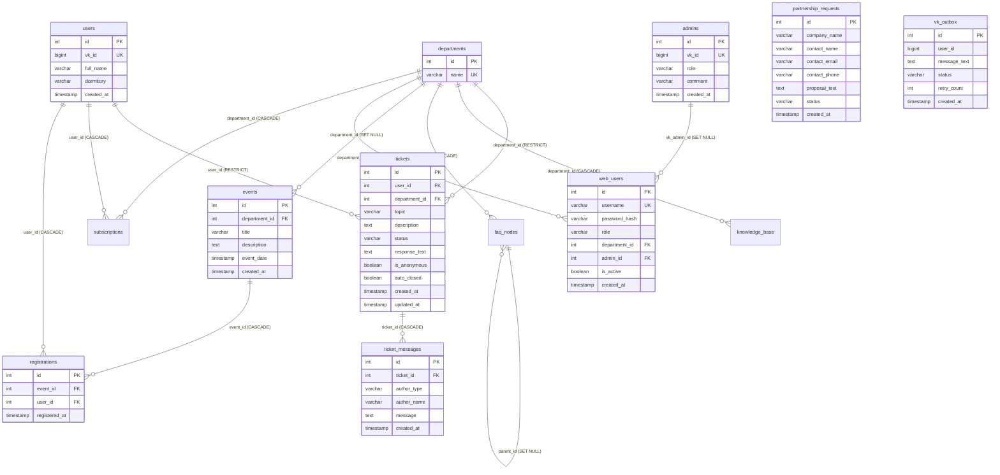

# 🗄️ Схема базы данных OSS Bot (v0.8.8)

> **Версия схемы данных:** 0.8.8  
> **СУБД:** PostgreSQL 16 (с расширением `pg_trgm`)  
> **Диспетчер миграций:** Alembic  
> **Пул соединений:** PgBouncer (режим `transaction pooling`, порт `6432`)

---

## 1. Диаграмма связей сущностей (Entity-Relationship Diagram)

---

## 2. Описание таблиц

### 2.1. Основные пользователи и организационная структура

#### `departments` — Подразделения Студенческого совета
Хранит перечень отделов (Жилищно-бытовой, Культурно-массовый, Информационный, Корпоративный).
- `id` (INTEGER, PK) — уникальный номер.
- `name` (VARCHAR, UNIQUE) — наименование отдела.

#### `users` — Профили студентов (пользователей бота)
- `id` (INTEGER, PK) — внутренний идентификатор.
- `vk_id` (BIGINT, UNIQUE) — числовой ID пользователя ВКонтакте.
- `full_name` (VARCHAR) — имя и фамилия (из профиля ВК).
- `dormitory` (VARCHAR) — общежитие и комната (при наличии).
- `created_at` (TIMESTAMP) — дата первой регистрации в боте.

#### `admins` — VK-администраторы бота
- `id` (INTEGER, PK) — первичный ключ.
- `vk_id` (BIGINT, UNIQUE) — ID ВКонтакте с правами администратора бота.
- `role` (VARCHAR) — роль в боте (`ADMIN`, `SUPERADMIN`).
- `comment` (VARCHAR) — служебное примечание / должность.
- `created_at` (TIMESTAMP) — дата назначения.

#### `web_users` — Пользователи веб-панели управления
- `id` (INTEGER, PK) — первичный ключ.
- `username` (VARCHAR, UNIQUE) — логин для авторизации.
- `password_hash` (VARCHAR) — хеш пароля (Argon2id / bcrypt).
- `role` (VARCHAR) — роль доступа (`SUPERADMIN` или `DEPARTMENT_ADMIN`).
- `department_id` (INTEGER, FK) — курируемый отдел (для операторов).
- `admin_id` (INTEGER, FK) — ссылка на VK-администратора (для 2FA).
- `is_active` (BOOLEAN) — признак активности аккаунта.
- `created_at` (TIMESTAMP) — дата регистрации.

---

### 2.2. Обращения и переписка

#### `tickets` — Заявки студентов
- `id` (INTEGER, PK) — номер тикета (отображается как `#142`).
- `user_id` (INTEGER, FK) — автор заявки (`NULL` для полностью анонимных).
- `department_id` (INTEGER, FK) — ответственный отдел.
- `topic` (VARCHAR) — тема обращения.
- `description` (TEXT) — подробное описание проблемы (до 3000 символов).
- `status` (VARCHAR) — статус заявки (`Новое`, `В обработке`, `Выполнено` и др.).
- `response_text` (TEXT) — финальный текст официального ответа.
- `is_anonymous` (BOOLEAN) — флаг анонимного обращения.
- `auto_closed` (BOOLEAN) — закрыта ли заявка автоматически по тайм-ауту.
- `created_at` / `updated_at` (TIMESTAMP) — метки времени создания и обновления.

#### `ticket_messages` — Хронология сообщений тикета
- `id` (INTEGER, PK) — ID сообщения.
- `ticket_id` (INTEGER, FK) — привязка к тикету.
- `author_type` (VARCHAR) — `USER`, `ADMIN` или `SYSTEM`.
- `author_name` (VARCHAR) — имя автора сообщения.
- `message` (TEXT) — текст реплики.
- `created_at` (TIMESTAMP) — время отправки.

---

### 2.3. Мероприятия и контент

#### `events` — Афиша мероприятий
- `id` (INTEGER, PK) — идентификатор события.
- `department_id` (INTEGER, FK) — отдел-организатор.
- `title` (VARCHAR) — название мероприятия.
- `description` (TEXT) — подробное описание и программа.
- `event_date` (TIMESTAMP) — дата и время проведения.
- `created_at` (TIMESTAMP) — дата публикации.

#### `registrations` — Записи студентов на события
- `id` (INTEGER, PK) — номер регистрации.
- `event_id` (INTEGER, FK) — мероприятие.
- `user_id` (INTEGER, FK) — зарегистрировавшийся студент.
- `registered_at` (TIMESTAMP) — время записи.

#### `faq_nodes` — Интерактивное дерево частых вопросов (FAQ)
- `id` (INTEGER, PK) — первичный ключ узла.
- `department_id` (INTEGER, FK) — привязка к отделу.
- `parent_id` (INTEGER, FK) — родительский узел (для многоуровневых меню).
- `question` (TEXT) — текст вопроса на кнопке.
- `final_answer` (TEXT) — ответ бота при переходе к этому узлу.
- `order_index` (INTEGER) — порядок сортировки кнопок.
- `is_final` (BOOLEAN) — терминальный ли это узел дерева.

#### `knowledge_base` — База знаний и типовые ответы
- `id` (INTEGER, PK) — ID статьи.
- `department_id` (INTEGER, FK) — профильный отдел.
- `keywords` (TEXT) — ключевые слова для поиска.
- `answer` (TEXT) — подробный текст регламента/статьи.
- `created_at` (TIMESTAMP) — время создания.

#### `partnership_requests` — Партнёрские заявки
- `id` (INTEGER, PK) — номер запроса.
- `company_name` (VARCHAR) — наименование организации-партнёра.
- `contact_name` (VARCHAR) — контактное лицо.
- `contact_email` (VARCHAR) — email.
- `contact_phone` (VARCHAR) — телефон.
- `telegram_contact` (VARCHAR) — Telegram.
- `proposal_text` (TEXT) — текст предложения.
- `status` (VARCHAR) — статус рассмотрения.
- `created_at` / `updated_at` (TIMESTAMP).

---

### 2.4. Безопасность, Outbox и служебные таблицы

#### `vk_outbox` — Очередь гарантированной отправки сообщений (Transactional Outbox)
- `id` (INTEGER, PK) — идентификатор сообщения в очереди.
- `user_id` (BIGINT) — VK ID получателя.
- `message_text` (TEXT) — текст сообщения.
- `status` (VARCHAR) — `pending`, `sent`, `failed`.
- `retry_count` (INTEGER) — количество попыток отправки.
- `scheduled_at` (TIMESTAMP) — время следующей попытки.
- `created_at` / `sent_at` (TIMESTAMP).

#### `logs` — Журнал аудита действий
- `id` (INTEGER, PK) — номер записи аудита.
- `admin_id` (INTEGER) — ID администратора (или 0 для системных событий).
- `action` (VARCHAR) — тип операции (вход, ответ, сброс пароля).
- `details` (TEXT) — контекст события (ID сущности, изменённые поля).
- `ip_address` (VARCHAR) — IP-адрес инициатора.
- `created_at` (TIMESTAMP) — метка времени.

#### `login_attempts` и `crud_attempts` — Защита от перебора и флуда
- Таблицы распределённого ограничения частоты запросов (`DBRateLimiter`).
- Фиксируют IP-адрес, окно попыток и время временной блокировки.

#### `dynamic_settings` — Динамические параметры конфигурации
- `key` (VARCHAR, PK) — ключ параметра (например, `TWO_FACTOR_ENABLED`).
- `value_json` (JSONB / TEXT) — значение параметра.
- `description` (TEXT) — описание назначения настройки.
- `updated_at` (TIMESTAMP) — время изменения.
