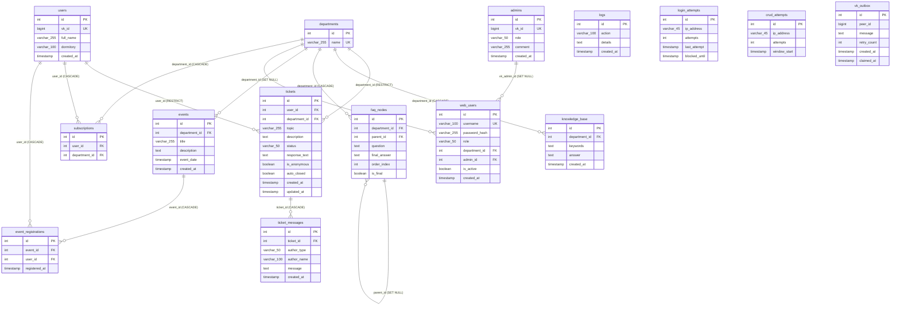

# Схема базы данных OSS Bot (PostgreSQL 16)

> **Версия схемы:** 0.8.4.1  
> **Диалект СУБД:** PostgreSQL 16 (с расширением `pg_trgm`)  
> **Диспетчер миграций:** Alembic  
> **Пул соединений:** PgBouncer (режим `transaction pooling`)

---

## 1. Диаграмма связей сущностей (Entity-Relationship Diagram)

---

## 2. Описание таблиц

### 2.1. `departments` (Отделы и направления)
Справочник структурных подразделений (Профком, Общежития, Учебный отдел и др.).
* `id` (INTEGER, PK, autoincrement): Уникальный номер.
* `name` (VARCHAR(255), UNIQUE, NOT NULL): Название подразделения.

### 2.2. `users` (Студенты / Пользователи ВКонтакте)
Профили студентов, взаимодействующих с ботом.
* `id` (INTEGER, PK, autoincrement): Идентификатор пользователя.
* `vk_id` (BIGINT, UNIQUE, NOT NULL): Числовой VK ID профиля студента.
* `full_name` (VARCHAR(255), NULL): Имя и фамилия из профиля VK.
* `dormitory` (VARCHAR(100), NULL): Номер или адрес общежития.
* `created_at` (TIMESTAMP WITH TIME ZONE, DEFAULT now()): Дата первого обращения.

### 2.3. `admins` (Администраторы VK)
Справочник администраторов сообщества ВКонтакте.
* `id` (INTEGER, PK, autoincrement): Идентификатор.
* `vk_id` (BIGINT, UNIQUE, NOT NULL): VK ID администратора.
* `role` (VARCHAR(50), NOT NULL): Роль (`admin`, `superadmin`).
* `comment` (VARCHAR(255), NULL): Примечание (ФИО, должность).
* `created_at` (TIMESTAMP WITH TIME ZONE, DEFAULT now()).

### 2.4. `tickets` (Заявки / Обращения студентов)
Центральная таблица тикет-системы.
* `id` (INTEGER, PK, autoincrement): Номер заявки.
* `user_id` (INTEGER, FK -> `users.id`, ON DELETE RESTRICT): Автор.
* `department_id` (INTEGER, FK -> `departments.id`, ON DELETE RESTRICT, NULL): Назначенный отдел.
* `topic` (VARCHAR(255), NOT NULL): Тема обращения.
* `description` (TEXT, NOT NULL): Подробный текст (до 3000 символов).
* `status` (VARCHAR(50), NOT NULL, DEFAULT 'NEW'): Статус жизненного цикла.
* `response_text` (TEXT, NULL): Последний официальный ответ.
* `is_anonymous` (BOOLEAN, DEFAULT FALSE): Флаг скрытия автора.
* `auto_closed` (BOOLEAN, DEFAULT FALSE): Закрыта ли автоматически.
* `created_at`, `updated_at` (TIMESTAMP WITH TIME ZONE).

### 2.5. `ticket_messages` (История переписки по заявке)
Каждое сообщение студента, администратора или системное событие.
* `id` (INTEGER, PK, autoincrement).
* `ticket_id` (INTEGER, FK -> `tickets.id`, ON DELETE CASCADE).
* `author_type` (VARCHAR(50), NOT NULL): `USER`, `ADMIN`, `SYSTEM`.
* `author_name` (VARCHAR(100), NULL): Имя отправителя.
* `message` (TEXT, NOT NULL): Текст сообщения.
* `created_at` (TIMESTAMP WITH TIME ZONE, DEFAULT now()).

### 2.6. `web_users` (Пользователи веб-панели управления)
Учётные записи операторов и супервайзеров.
* `id` (INTEGER, PK, autoincrement).
* `username` (VARCHAR(100), UNIQUE, NOT NULL): Логин.
* `password_hash` (VARCHAR(255), NOT NULL): Хеш пароля (Argon2id / bcrypt).
* `role` (VARCHAR(50), NOT NULL): `SUPERADMIN` или `DEPARTMENT_ADMIN`.
* `department_id` (INTEGER, FK -> `departments.id`, ON DELETE SET NULL, NULL): Привязка к отделу (IDOR-изоляция).
* `admin_id` (INTEGER, FK -> `admins.id`, ON DELETE SET NULL, NULL): Привязка к VK для получения 2FA-кодов.
* `is_active` (BOOLEAN, DEFAULT TRUE): Флаг активности.
* `created_at` (TIMESTAMP WITH TIME ZONE, DEFAULT now()).

### 2.7. `knowledge_base` (База знаний)
Статьи и инструкции для мгновенного поиска по ключевым словам.
* `id` (INTEGER, PK, autoincrement).
* `department_id` (INTEGER, FK -> `departments.id`, ON DELETE CASCADE, NULL).
* `keywords` (TEXT, NOT NULL): Ключевые слова через запятую.
* `answer` (TEXT, NOT NULL): Текст инструкции.
* `created_at` (TIMESTAMP WITH TIME ZONE, DEFAULT now()).

### 2.8. `faq_nodes` (Иерархическое дерево FAQ)
Категории и ответы на типовые вопросы в VK-боте.
* `id` (INTEGER, PK, autoincrement).
* `department_id` (INTEGER, FK -> `departments.id`, ON DELETE CASCADE).
* `parent_id` (INTEGER, FK -> `faq_nodes.id`, ON DELETE SET NULL, NULL): Родительский узел.
* `question` (TEXT, NOT NULL): Текст вопроса/категории.
* `final_answer` (TEXT, NULL): Ответ (если узел конечный).
* `order_index` (INTEGER, DEFAULT 0): Позиция при сортировке.
* `is_final` (BOOLEAN, DEFAULT FALSE): Признак конечного ответа.

### 2.9. `events` & `event_registrations` (Мероприятия и записи)
* `events`: `id`, `department_id` (FK, SET NULL), `title`, `description`, `event_date`, `created_at`.
* `event_registrations`: `id`, `event_id` (FK, CASCADE), `user_id` (FK, CASCADE), `registered_at`. Уникальная пара (`event_id`, `user_id`).

### 2.10. `vk_outbox` (Надёжная доставка сообщений / Паттерн Outbox)
* `id` (INTEGER, PK).
* `peer_id` (BIGINT, NOT NULL): Адресат в VK.
* `message` (TEXT, NOT NULL): Текст сообщения.
* `retry_count` (INTEGER, DEFAULT 0): Счётчик попыток.
* `created_at`, `claimed_at` (TIMESTAMP WITH TIME ZONE).

### 2.11. `login_attempts` & `crud_attempts` & `logs` (Безопасность и аудит)
* `login_attempts`: фиксация неудачных входов по IP с блокировкой (`blocked_until`).
* `crud_attempts`: лимит опасных мутирующих действий (не более 20 за 5 минут на IP).
* `logs`: аудит всех действий администраторов (`action`, `details`, `created_at`).

---

## 3. Индексы и производительность
1. **GIN-индексы `pg_trgm`**: Полнотекстовый нечёткий поиск без задержек по `tickets.topic`, `tickets.description`, `tickets.response_text`, `users.full_name`, `knowledge_base.keywords`.
2. **B-Tree индексы**:
   - `idx_tickets_department_status`: быстрый фильтр по отделу и статусу заявки.
   - `idx_ticket_messages_ticket_id`: мгновенная загрузка истории диалога.
   - `idx_login_attempts_ip_blocked`: быстрая проверка блокировки IP.
   - `idx_outbox_unprocessed`: выборка неотправленных сообщений `WHERE claimed_at IS NULL`.
